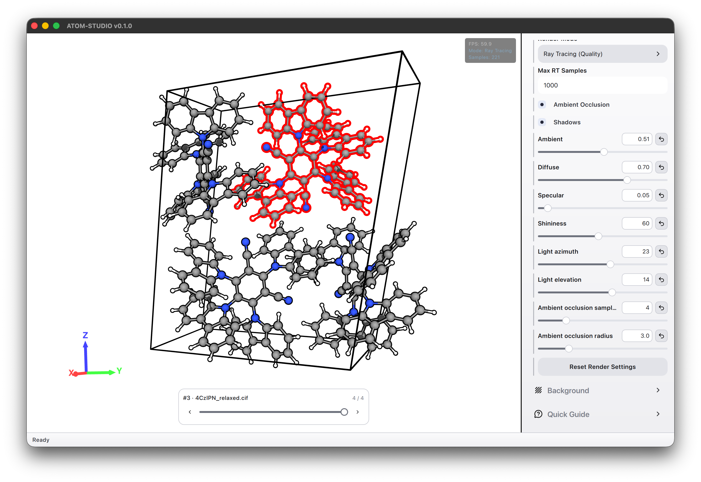
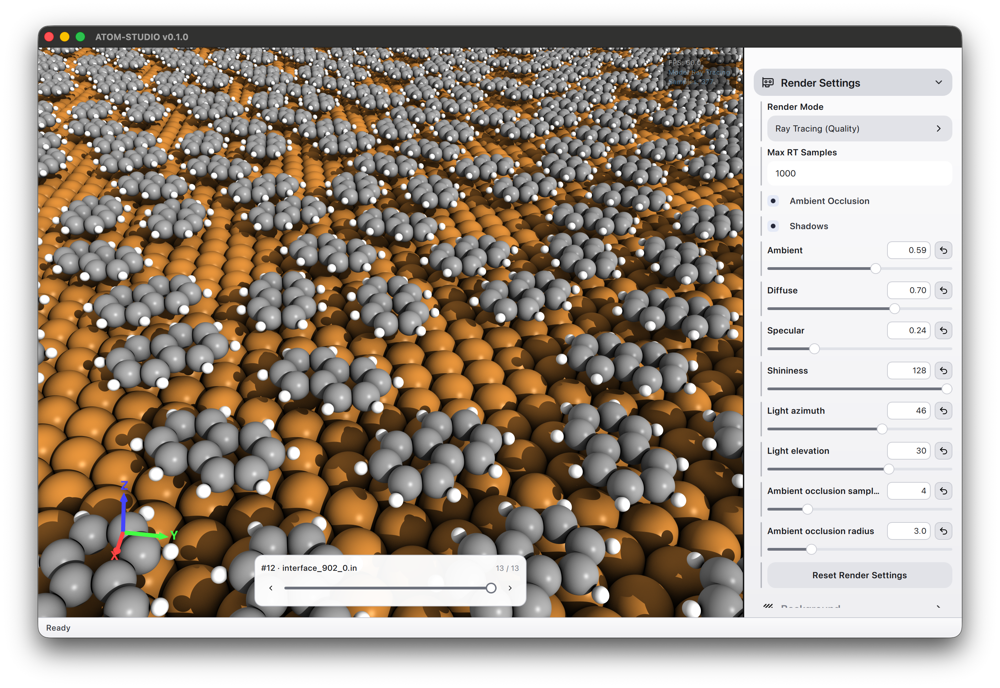
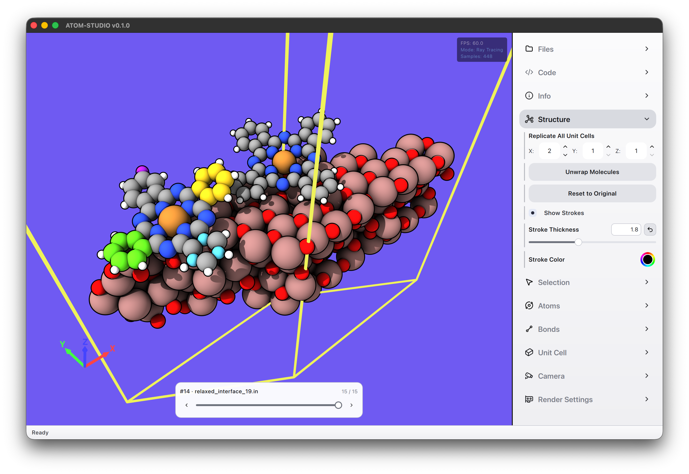

<p align="center">
  
</p>

<h1 align="center">ATOM-STUDIO</h1>

<p align="center">Explore, edit, and visualize atomic structures on your desktop.</p>

<p align="center">
  
</p>

ATOM-STUDIO brings interactive 3D visualization, ray-traced rendering, and Python/ASE
scripting into one workspace. Inspect molecules and crystals, compare structures,
watch a relaxation run, and export images or edited geometries.

## Highlights

- **Interactive visualization** — rotate, pan, and zoom; switch between perspective
  and orthographic views; customize atoms, bonds, unit cells, colors, and lighting.
- **Ray-traced rendering** — add shadows and ambient occlusion for clear,
  polished images, with transparent-background PNG export.
- **Multiple structures** — load several files and switch between them while
  keeping each structure's edits and selections.
- **Structure editing** — replicate unit cells, unwrap molecules, and select,
  customize, or delete atoms and bonds.
- **Python in the viewport** — edit ASE structures and preview simulations live
  in a persistent interactive shell. Install additional packages, including MACE
  and UMA / FAIRChem, from the app.
- **Flexible file support** — import ASE-supported formats such as XYZ, CIF,
  POSCAR, PDB, and LAMMPS; export edited structures as FHI-aims `.in`, CIF,
  POSCAR, or extended XYZ.

macOS is the primary validated platform, with an automated installer build.
Linux and Windows development builds are also available; package management and
external-terminal integration still need validation on those platforms.

## Install on macOS

**Requires macOS 14 or newer**, internet access for missing dependencies, and
several GB of free disk space. Apple Silicon is the primary build target;
native Intel builds are attempted but may require additional dependency setup.

1. Clone this repository or choose **Code → Download ZIP** on GitHub and extract it.
2. Open Terminal in the `atom-studio` folder and run:

   ```bash
   bash scripts/build-macos-dmg.sh
   ```

3. When the disk image opens, drag **ATOM-STUDIO** into **Applications**.
   Eject the image and launch the app from Applications.

The script installs missing build tools, builds and tests the app, and packages
its dependencies. Follow any Apple Command Line Tools or Homebrew installer
prompts; an administrator password may be requested. Run as your normal user,
**without `sudo`**. No paid Apple Developer account is needed.

The installed app includes Python, ASE, NumPy, and Qt, so it needs no separate
Python or Conda installation. After copying it to Applications, you can remove
the source checkout.

<details>
<summary>Build options and troubleshooting</summary>

To leave the disk image closed and limit compilation to four jobs:

```bash
bash scripts/build-macos-dmg.sh --no-open --jobs 4
```

- **Output:** `out/macos/ATOM-STUDIO-<version>-macOS-<architecture>.dmg`,
  with a `.sha256` checksum beside it.
- **Build failure:** check `out/macos/build.log`, resolve the reported problem,
  and rerun the same command. Existing build dependencies are reused.
- **More options:** run `bash scripts/build-macos-dmg.sh --help`.
- **Sharing:** the app is locally signed, not Apple-notarized. A recipient may
  need to allow it through **System Settings → Privacy & Security → Open Anyway**.
  The disk image targets the build Mac's architecture and macOS version;
  compatibility with older systems is not guaranteed.

</details>

## Get started

1. **Open a structure.** Drag files into the viewport or choose
   **Files → Import Structures**. Use the bottom switcher when several structures
   are loaded.
2. **Explore the view.** Drag with the left mouse button to rotate, the right
   button to pan, and scroll to zoom. The **Camera** section offers standard
   view directions and projection options.
3. **Adjust the scene.** Use **Atoms**, **Bonds**, **Unit Cell**, **Render Settings**,
   and **Background** to change the appearance. Use **Structure → Replicate All
   Unit Cells** to build a supercell.
4. **Save your work.** Choose **Files → Export Images** for an image, or
   **Files → Export Structures** to save the active edited geometry.
   Enable **Transparent Background** for a transparent PNG. POSCAR export
   requires a unit cell.

**Reset to Original** restores the active structure's geometry and edits.
Replication settings apply to all structures with a unit cell; changing them
rebuilds those structures from their original inputs and replaces their edits.

### Work with Python

Open **Code → Open Interactive Shell**. Loaded structures are ASE `Atoms` objects
named `STRUCT_0`, `STRUCT_1`, and so on. For example, after loading your first structure:

```python
# Move every atom by 0.5 angstrom along z.
STRUCT_0.positions[:, 2] += 0.5
```

Choose **Run** or press **Command/Ctrl+Enter** to update the viewport. Variables
persist between runs; use `studio.update(atoms)` to show intermediate steps during
a simulation.

- **Code → Tutorial** provides a searchable offline guide with editing,
  relaxation, MACE, and UMA examples.
- **Code → Manage Packages** installs packages and manages separate Python environments.
- **Code → Open Environment Terminal** opens a terminal in the same environment
  for package installation and model authentication.

Additional calculators may require model downloads, access approval, or external
software. For UMA, follow the Tutorial's Hugging Face authentication steps.
Changing environments or restarting Python clears session variables and
calculators while retaining the loaded geometry and editor contents.

## Develop from source

Start with a clone or extracted copy of this repository. You will need:

- A **C++20 compiler** and **CMake 3.25+**.
- **Qt 6**, including Core, Gui, Widgets, OpenGL, Quick, QuickControls2, and
  Concurrent, plus SVG support for the interface icons.
- **Python with development headers/libraries**, **pybind11**, and the packages
  in [cmake/python-requirements.txt](cmake/python-requirements.txt).
  The automated macOS build uses Python 3.12.

A Vulkan SDK is not required. Run the following commands from the repository root.

<details>
<summary>macOS — Homebrew</summary>

Install Apple's Command Line Tools if needed (`xcode-select --install`), then
prepare the dependencies and a dedicated build environment:

```bash
brew install cmake qtbase qtdeclarative qtsvg python@3.12
"$(brew --prefix python@3.12)/bin/python3.12" -m venv .venv-build
.venv-build/bin/python -m pip install -r cmake/python-requirements.txt 'pybind11>=2.13,<4'
```

Configure, build, test, and launch:

```bash
cmake --preset=default \
  -DPython3_EXECUTABLE="$PWD/.venv-build/bin/python" \
  -Dpybind11_DIR="$(.venv-build/bin/python -m pybind11 --cmakedir)" \
  -DCMAKE_PREFIX_PATH="$(brew --prefix qtbase);$(brew --prefix qtdeclarative);$(brew --prefix qtsvg)"
cmake --build build --parallel 4
ctest --test-dir build --output-on-failure
./build/bin/atom-studio.app/Contents/MacOS/atom-studio
```

For a Release build, use `--preset=release` and replace `build` with
`build-release` in subsequent commands. To bundle Qt for that build, run
`cmake --build build-release --target deploy`. To create a complete installable
disk image, use the [macOS installation script](#install-on-macos).

</details>

<details>
<summary>Linux — system Qt</summary>

Install a C++20 compiler, Make, CMake 3.25+, the Qt 6 development packages listed
above, Python development libraries, and Python venv support through your
distribution's package manager. Ensure the Qt Quick Controls, Layouts, and Window
QML modules and the SVG image plugin are installed for runtime use.

```bash
python3 -m venv .venv-build
.venv-build/bin/python -m pip install -r cmake/python-requirements.txt 'pybind11>=2.13,<4'
cmake --preset=default \
  -DPython3_EXECUTABLE="$PWD/.venv-build/bin/python" \
  -Dpybind11_DIR="$(.venv-build/bin/python -m pybind11 --cmakedir)"
cmake --build build --parallel 4
ctest --test-dir build --output-on-failure
./build/bin/atom-studio
```

If Qt is installed outside the system search path, add
`-DCMAKE_PREFIX_PATH="/path/to/your/Qt/kit"` to the configure command.

</details>

<details>
<summary>Windows — MSVC and Qt</summary>

Install Visual Studio's C++ build tools, CMake, Ninja, Python, and a matching Qt 6
MSVC kit with the modules listed above. Use **Developer PowerShell for Visual
Studio**. Set `$qtRoot` to your installed Qt kit directory before running:

```powershell
$qtRoot = "C:/path/to/your/Qt/msvc-kit"
python -m venv .venv-build
$pythonExe = "$PWD/.venv-build/Scripts/python.exe"
& $pythonExe -m pip install -r cmake/python-requirements.txt 'pybind11>=2.13,<4'
$pybindDir = & $pythonExe -m pybind11 --cmakedir
cmake -S . -B build-windows -G Ninja -DCMAKE_BUILD_TYPE=Release `
  "-DPython3_EXECUTABLE=$pythonExe" "-Dpybind11_DIR=$pybindDir" `
  "-DCMAKE_PREFIX_PATH=$qtRoot"
cmake --build build-windows --parallel 4
$env:PATH = "$qtRoot/bin;$env:PATH"
ctest --test-dir build-windows --output-on-failure
./build-windows/bin/atom-studio.exe
```

Keep the compiler, Qt, and Python architectures consistent. This is a local
development build; automated installer packaging is currently provided for macOS.

</details>

Normal builds prepare the app's Python dependencies automatically. Tests that
exercise graphics need access to a suitable GPU and desktop session; also check
visual changes in the running app.

See [GUIDELINES.md](GUIDELINES.md) for architecture and contribution conventions,
and [CMakePresets.json](CMakePresets.json) for the available build configurations.
